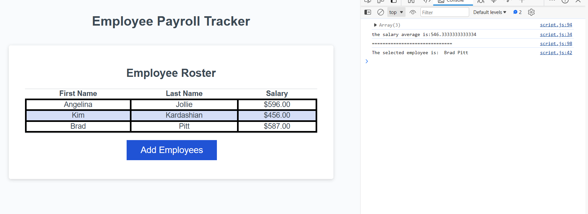

# Employee payroll

## Description

This project used more than 10 hours to finish, some codes that I tried it was not working well, after ready I'am really proud.
I've learning how to use random function, sum, "while", average function and prompts, and then use the answers from prompt in a function.

## Usage

Click on "Add Employees" then it will show a Prompt asking first and last name, and the salary to create a table, after the user fill the information, the webpage will ask if them want to continue adding employees, if the user click ok, they will be able to add more employees, if click cancel, the page will show a table with the information of employees.
After show the table, click inspect -> console to see the average salary and a random employee.

 

## Credits

I had some help from the lectures, xpert learning and google

some links that helped me:

https://www.w3resource.com/javascript-exercises/javascript-array-exercise-35.php

https://developer.mozilla.org/en-US/docs/Web/API/Window/prompt

https://developer.mozilla.org/en-US/docs/Web/JavaScript/Reference/Global_Objects/Math/random

https://stackoverflow.com/questions/17907455/how-to-get-numeric-value-from-a-prompt-box

https://www.quora.com/What-is-the-average-of-an-array-in-JavaScript

## Deployed page

https://jaquelineesteves.github.io/employee-payroll/

## Github Repository

https://github.com/jaquelineesteves/employee-payroll

